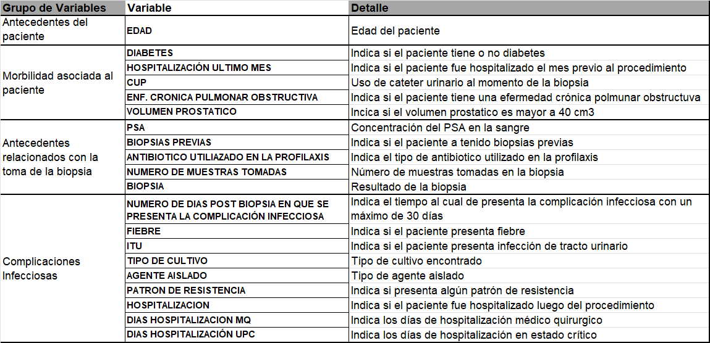

 # Machine Learning ejercicio:

## Juan Carlos Garzón R.

* Mayo, 20024.

 En un equipo de ciencia de datos en una consultora de renombre. Nos han asignado a un proyecto de estudio de atención en salud para un importante hospital. **Nuestro cliente desea saber las características más importantes que tienen los pacientes de cierto tipo de enfermedad que terminan en hospitalización.** Fue definido como caso aquel paciente que fue sometido a biopsia prostática y que en un periodo máximo de 30 días posteriores al procedimiento presentó fiebre, infección urinaria o sepsis; requiriendo manejo médico ambulatorio u hospitalizado para la resolución de la complicación y como control al paciente que fue sometido a biopsia prostática y que no presentó complicaciones infecciosas en el período de 30 días posteriores al procedimiento. Dado que tienen en su base de datos algunos datos referentes a los pacientes y resultados de exámenes diagnósticos, de pacientes hospitalizados y no hospitalizados

 Para el desarrollo del ejercicio se implementan tres fases: `Análisis exploratorio de datos`, `Preparación de datos` y `Modelamiento y evaluación`.

 Machine Learning en Medicina: Al aplicar Machine Learning en Medicina se pueden usar las herramientas informáticas, con el fin de conseguir información a partir de los datos, por ejemplo, de historias clínicas o registros de prestadores de servicios de salud. De esta manera, se pueden emitir diagnósticos predicitivos, evaluar la efectividad de estrategias de intervención y anticipar

 Para ello, nuestro departamento de datos ha recopilado `Antecedentes del paciente`, `Morbilidad asociada al paciente` y `Antecedentes relacionados con la toma de la biopsia`y `Complicaciones infecciosas`. En la siguiente tabla, se encuentra un diccionario de datos asociado:

 

En la fase de de análisis exploratorio, se basa en la fuente de datos relacionados a los pacientes, se encuentra en el archivo de tipo hoja electrónica llamado BBDD_Hospitalización.xlsx, seguido de ello, en la fase de preparación de datos, se genera el archivo data_normalizada.csv, el cual es el insumo para la fase de modelamiento y preparación que estan relacionados  los NoteBooks parte_1.ipynb y parte_2.ipynb. Concluyendo que es posible predecir 137 casos de verdaderos positivos de pacientes con posibles complicaciones luego de realizar toma de Biópsia y que son sometidos a internación hospitalaria.

